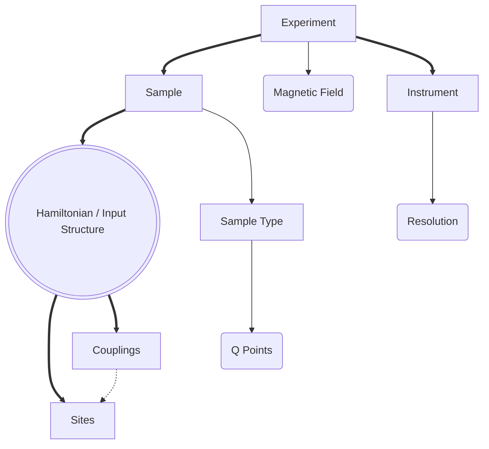
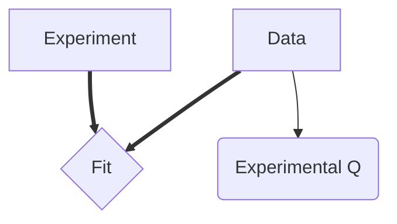
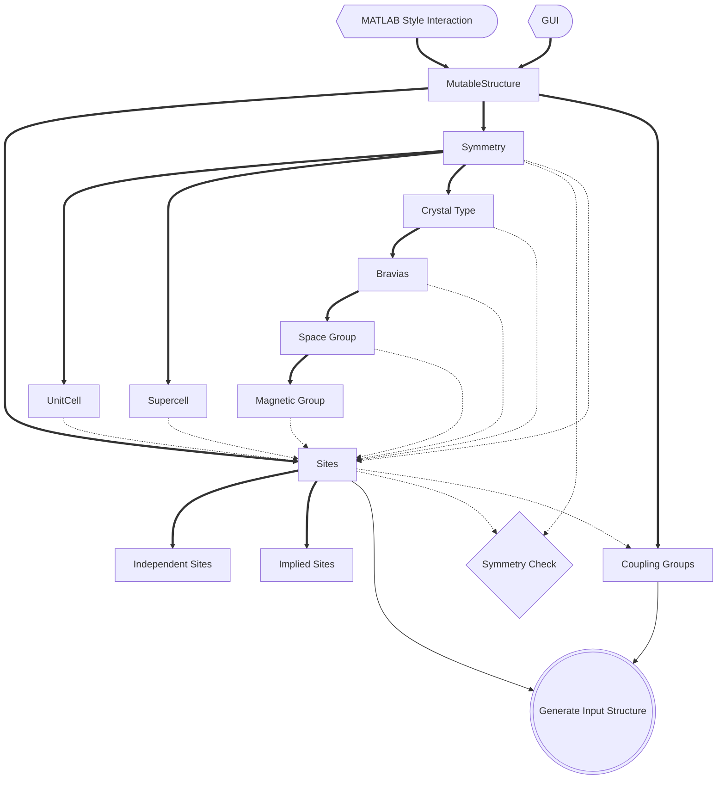

The basic structure of the input form for calculations

If we want to perform a fit to data rather than just a calculation, we can plug this into the Experiment class:

where the fit is over chosen parameters in the sample.

The input structure in the circle is generated from a more detailed, dynamic, user-friendly structure.
The MutableStructure class is responsible for making the structure user friendly. It is used internally by MATLAB style interface and provides the model for the GUI. 
The solid lines show the structure, and the dotted lines show actions that need to be taken to keep the stucture synchronised and valid.

