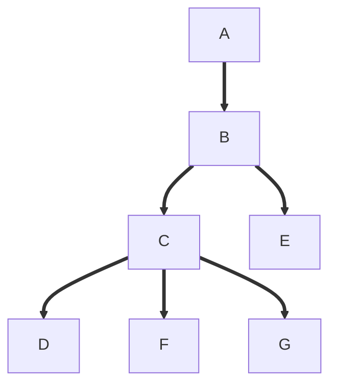
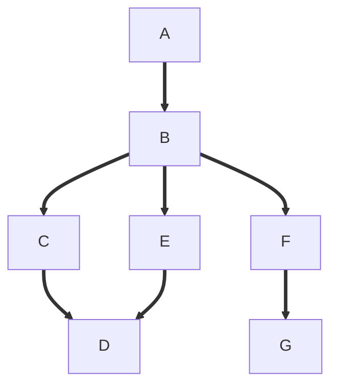
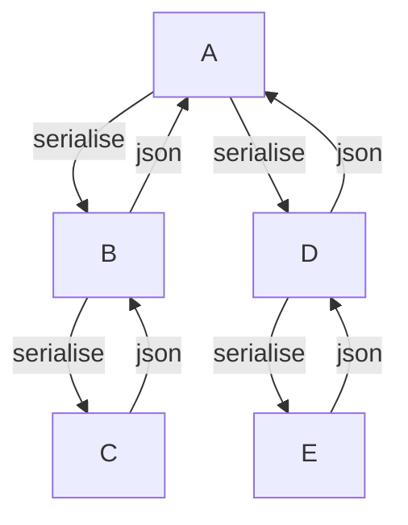
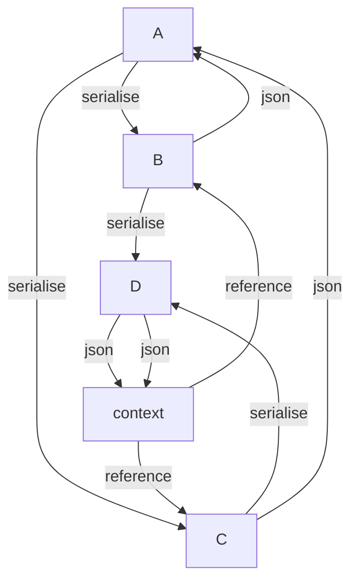

Serialisation
=============

The data structures in pySpinW are not a simple tree, but have shared leaves/branches. That is to say, it **does not** look like this...

But instead looks more like this...

A common strategy for serialisation for a tree like structure is to recursively serialise/deserialise the tree, starting at the root node.
First we call `serialise` on the root node, then the root node calls `serialise` on its children and collects it into an object, the children
then call `serialise` on their children, collecting the data, and so on.

However, if we do this with the data structures in pySpinW, shared nodes will be duplicated. Instead we need to do something different. 
Whilst doing this we would like to keep to a tree-like serialisation much as possible, as we only deviate a small bit.

Contexts
========

The strategy used to serialise pySpinW data is to use "contexts". 
When we come to a node that can be a duplicate, instead of serilising diretly, we interact with a context object:
1) We serialise the data for our node, but don't return it
2) Store the data with an id in the context object
3) Instead of returning the serialised data, we return a reference containing the id to caller
4) At the end of the serialisation, the data in the context is serialised in parallel

TODO: Better diagram

Serialisation Methods
=====================

In practice, we implement `serialise` and `deserialise` exactly 
once, in the `SPWSerialisable` class.
These are public methods whose responsibility is to the create the serialisation context,
provide it to the private methods `_serialise` and `_deserialise` which are recursive,
and span the tree.
It is also responsible for making sure that the context is serialised/deserialised.

`_serialise` and `_deserialise` are not the only serialisation methods that 
appear in the codebase.
When a serialised class contains another, it can specify the type of contained class,
and serialisation of the contained class depends on whether this class unique, 
or whether there are multiple subclasses.

In the case where there are multiple subclasses, we follow the pattern of
creating seperate private method (e.g. `_serialise_transform`) in the base class,
which is called by the `_serialise` method. The serialise method will specify which
subclass has been serialised, and return a dict of the form `{"type": ..., "data":...}`
Each subclass will have the same `serialisation_name` but will have
a different key for the other method, e.g. `transform_name`.