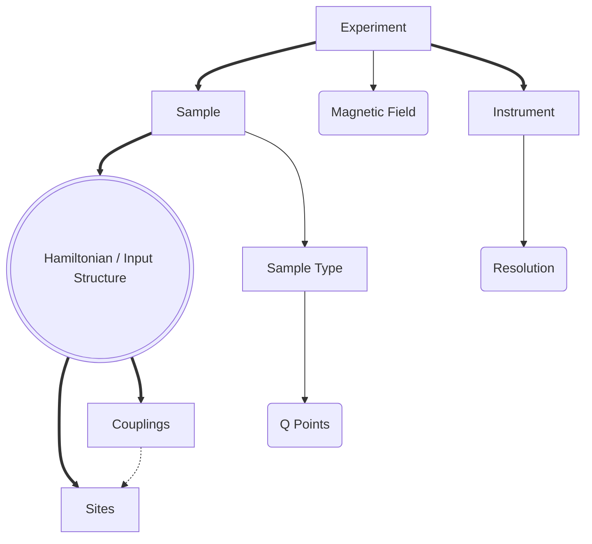

Serialisation Methods
=====================

The data structures in pySpinW are not a simple tree, but have shared leaves/branches

```mermaid
   graph TD;
       A[Experiment]==>B[Sample]==>C(((Hamiltonian / Input Structure)))==>D[Sites];
       C==>E[Couplings]-.->D;
       A-->F(Magnetic Field);
       A==>G[Instrument]-->H(Resolution);
       B-->Ba[Sample Type]-->Bb(Q Points);
       
```